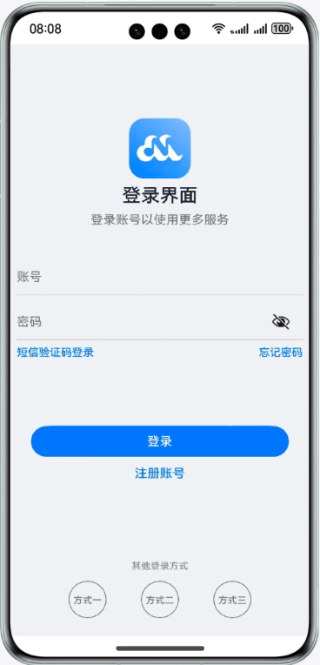

# 常用组件与布局

### 简介

HarmonyOS ArkUI提供了丰富多样的UI组件，您可以使用这些组件轻松地编写出更加丰富、漂亮的界面。在本篇Codelab中，您将通过一个简单的购物社交应用示例，学习如何使用常用的基础组件和容器组件。本示例主要包含：“登录”、“首页”、“我的”三个页面。效果图如下：

### 相关概念

- Image：Image为图片组件，常用于在应用中显示图片。Image支持加载string、PixelMap和Resource类型的数据源，支持png、jpg、bmp、svg和gif类型的图片格式。

- TextInput：单行文本输入框组件。

- LoadingProgress：用于显示加载动效的组件。

- Flex：以弹性方式布局子组件的容器组件。

- List：列表包含一系列相同宽度的列表项。适合连续、多行呈现同类数据，例如图片和文本。

- Swiper：滑块视图容器，提供子组件滑动轮播显示的能力。

- Grid：网格容器，由“行”和“列”分割的单元格所组成，通过指定“项目”所在的单元格做出各种各样的布局。

### 相关权限

不涉及

### 使用说明

1. 在登录界面输入账号和密码（任意字符），点击登录按钮跳转到应用首页。
2. 点击底部的Tabs，界面在“首页”和“我的”之间进行切换。

### 约束与限制

1. 本示例仅支持标准系统上运行，支持设备：华为手机。
2. HarmonyOS系统：HarmonyOS NEXT Developer Beta1及以上。
3. DevEco Studio版本：DevEco Studio NEXT Developer Beta1及以上。
4. HarmonyOS SDK版本：HarmonyOS NEXT Developer Beta1 SDK及以上。
