# AdvisoryCore 系统架构图

## 1. 整体系统架构图

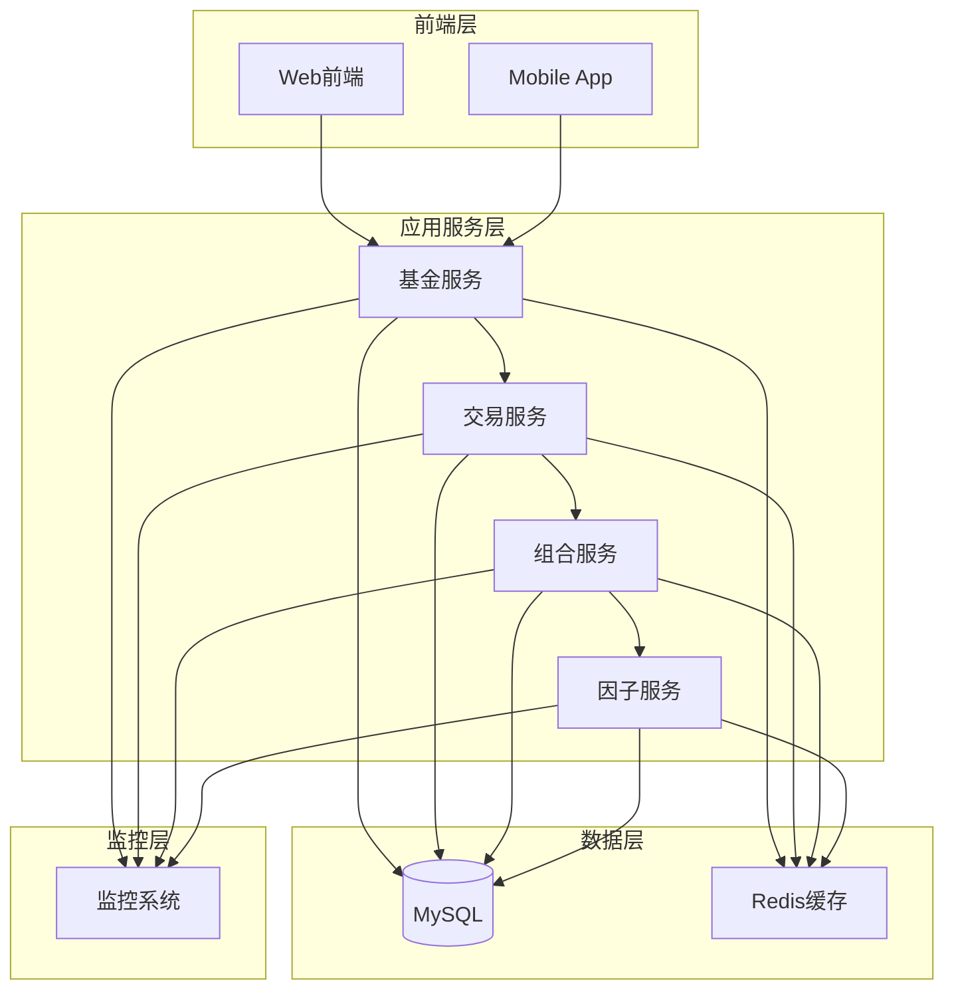

## 2. 分层架构图

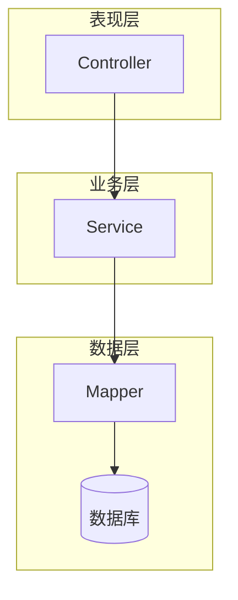

## 3. 核心业务模块图

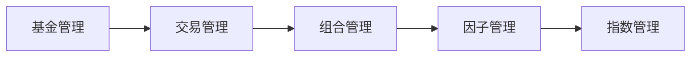

## 4. 数据流图

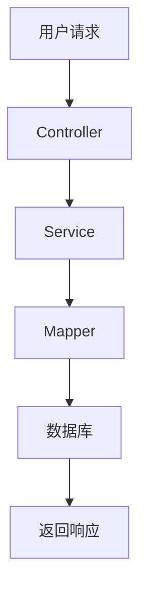

## 5. 数据库关系图

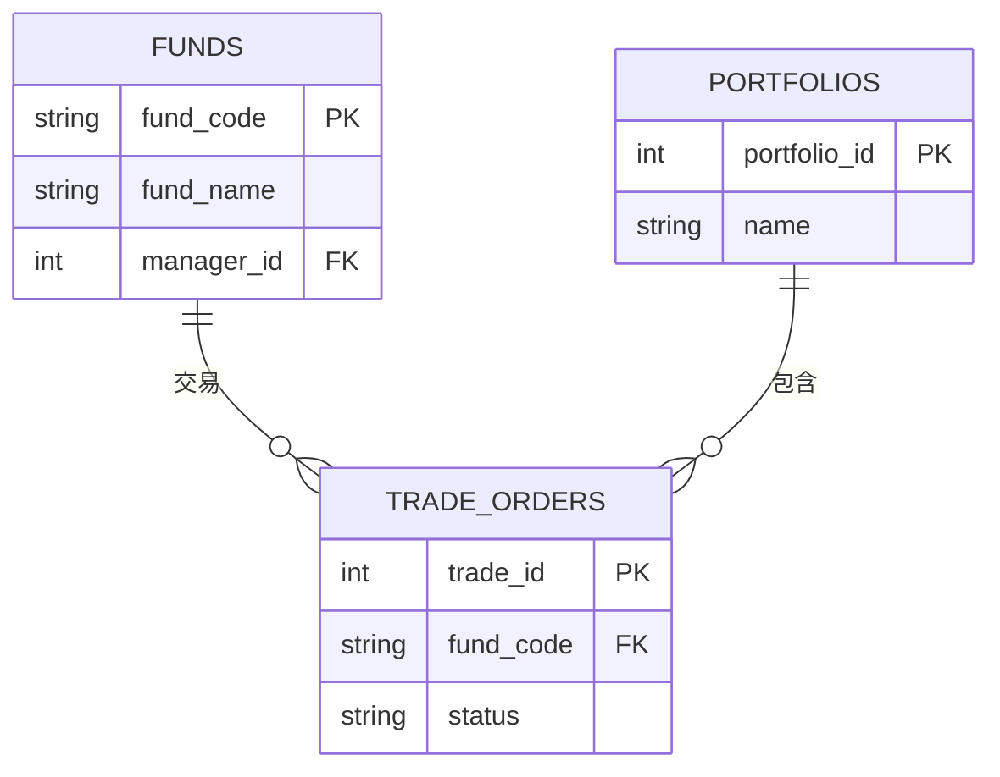

## 6. 部署架构图

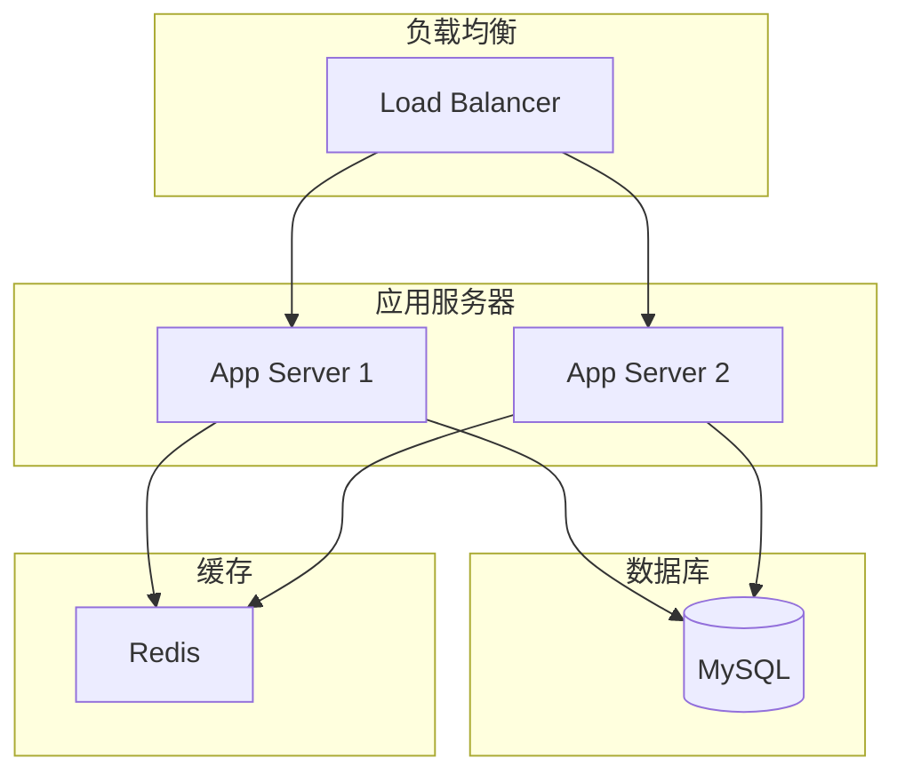

## 7. 微服务架构图

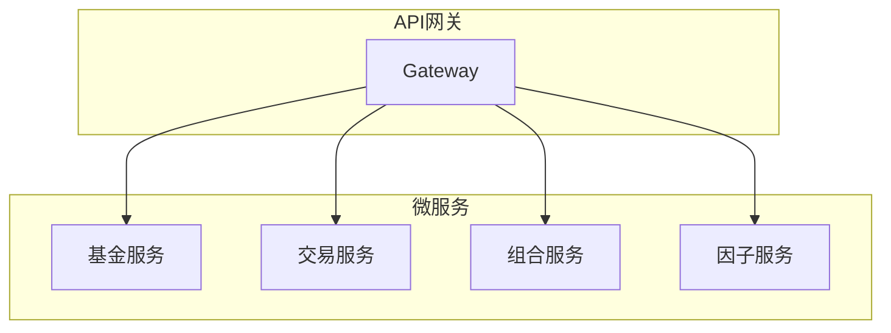

## 8. 技术栈图

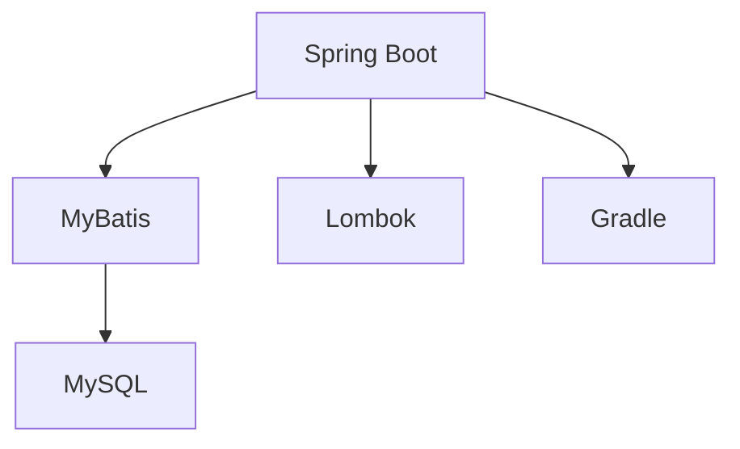

## 9. 安全架构图

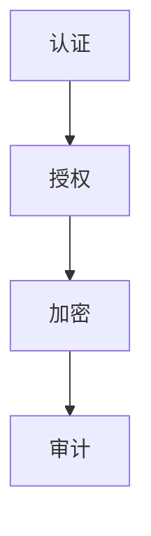

## 10. 性能优化图

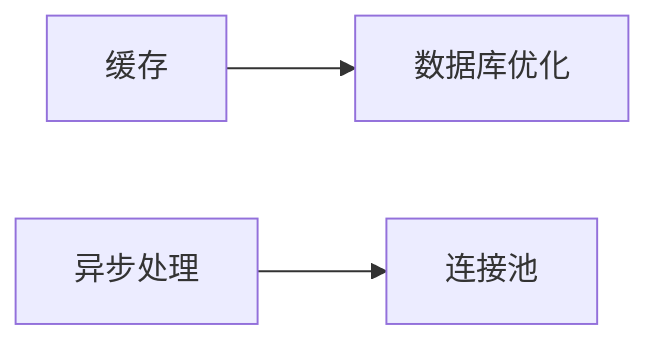

## 11. 监控架构图

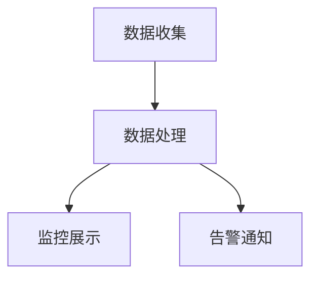

## 12. 开发流程图

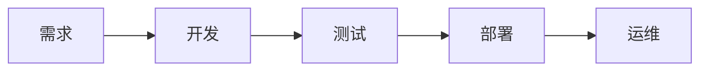

---

*这些简化后的架构图保留了系统的核心架构信息，更加简洁易读，便于快速理解系统结构。* 