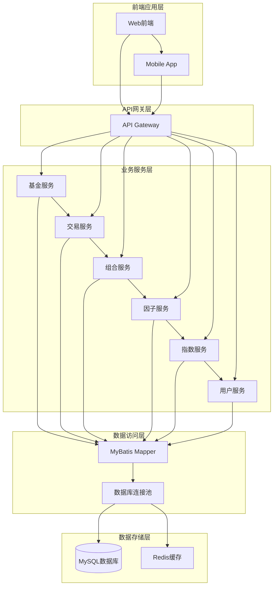
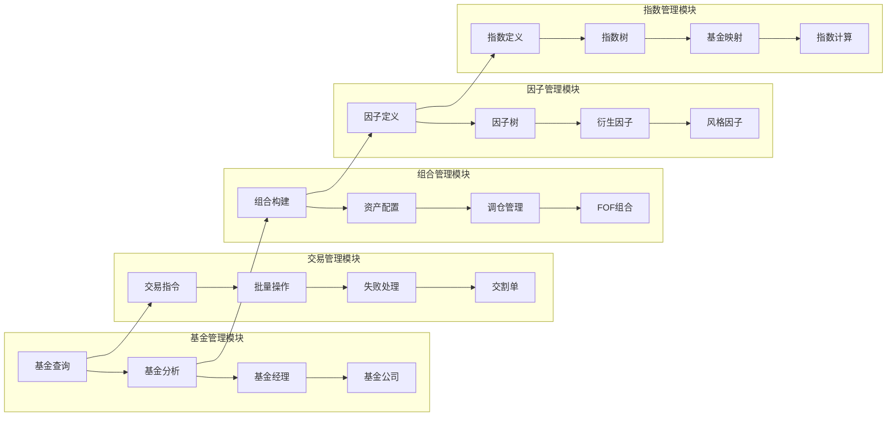
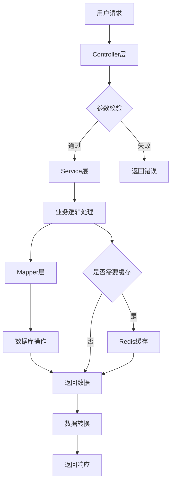
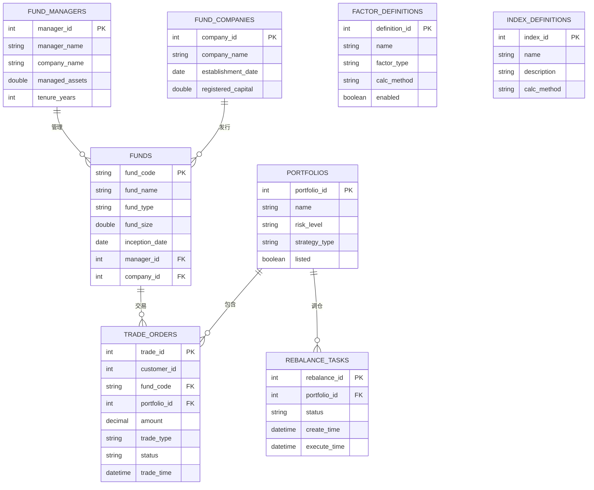
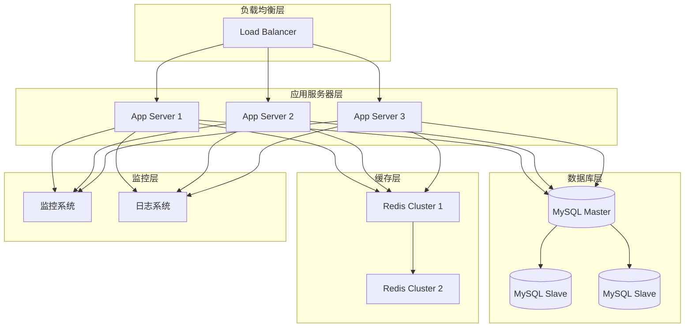
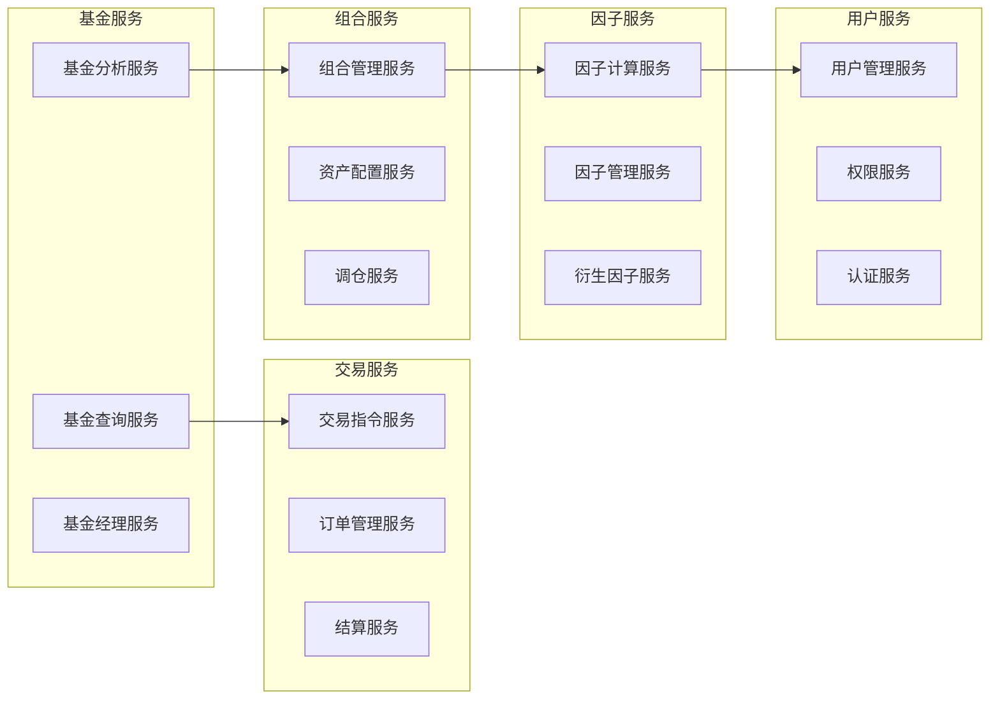
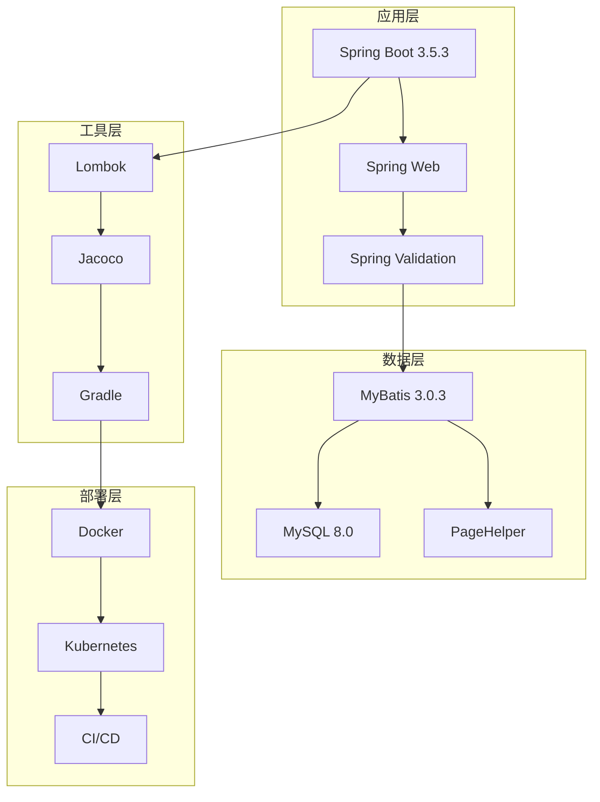
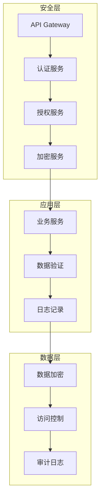
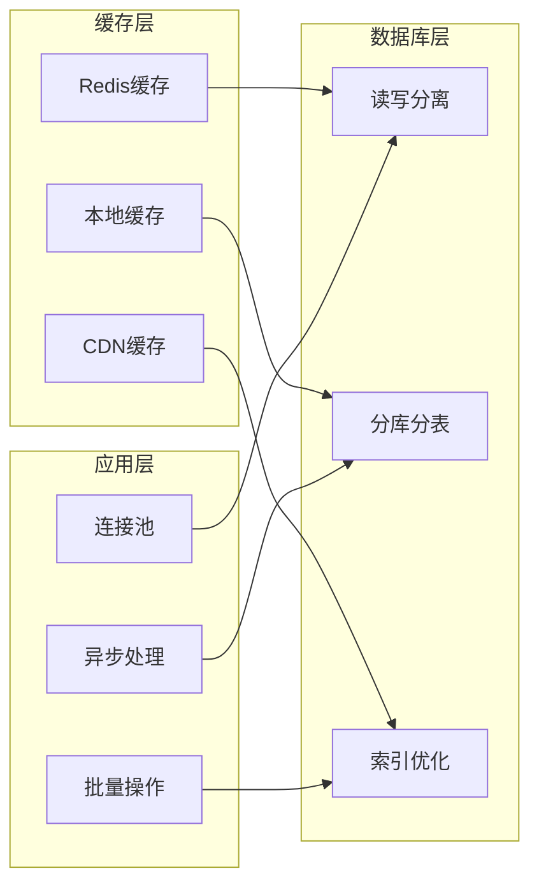
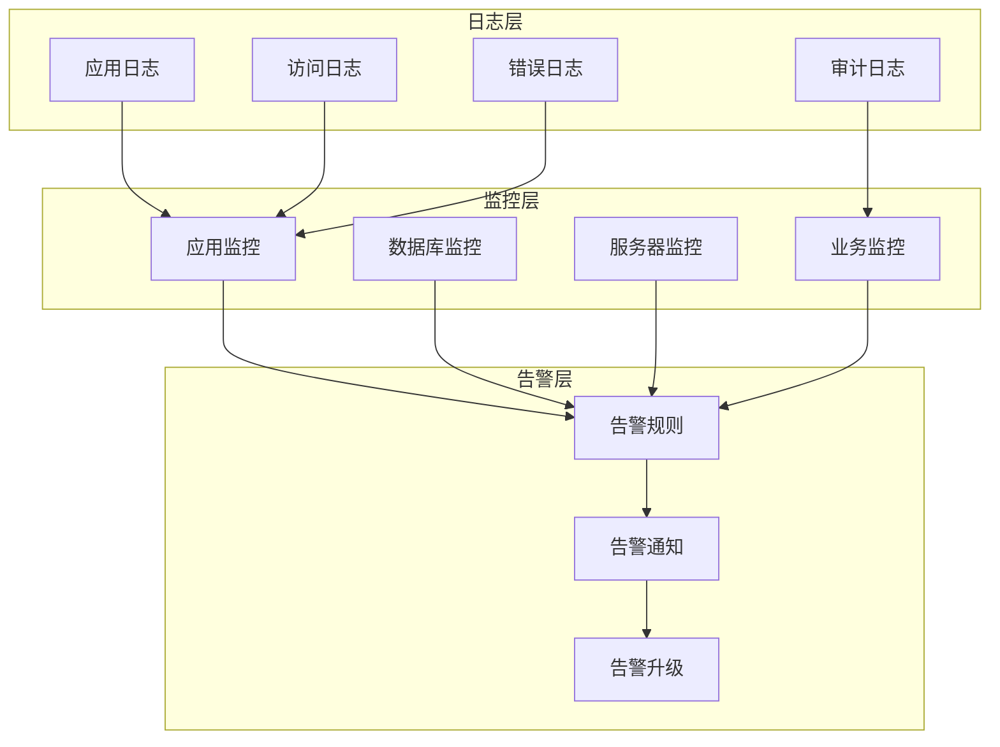

# AdvisoryCore 系统架构图

## 1. 系统组件架构图

## 2. 核心业务模块关系图

## 3. 数据流图

## 4. 数据库ER图

## 5. 部署架构图

## 6. 微服务拆分建议

## 7. 技术栈架构图

## 8. 安全架构图

## 9. 性能优化架构图

## 10. 监控架构图

---

*这些架构图展示了AdvisoryCore系统的各个层面，包括组件关系、数据流、部署方案等，为系统的开发和维护提供了清晰的指导。* 